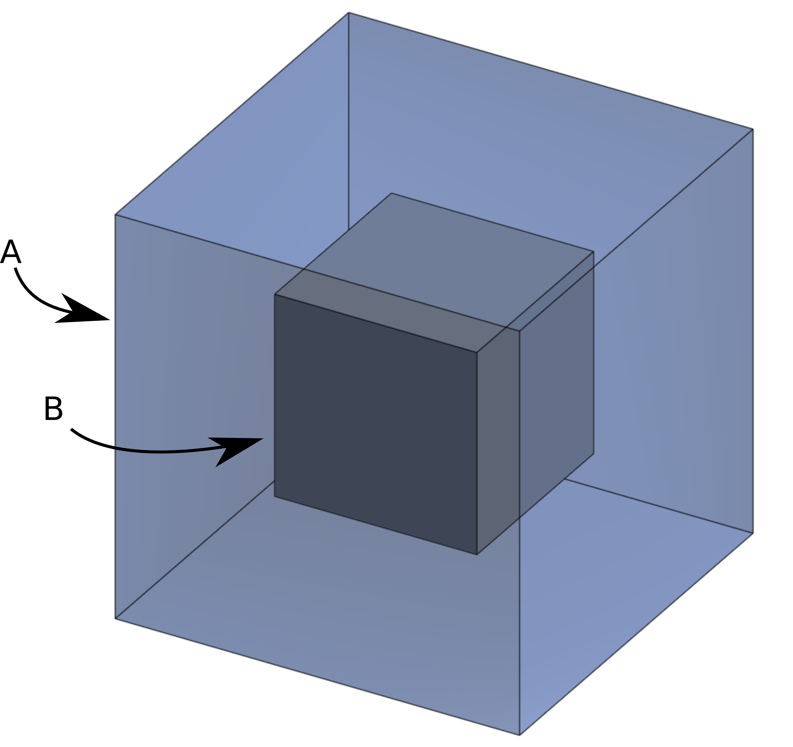
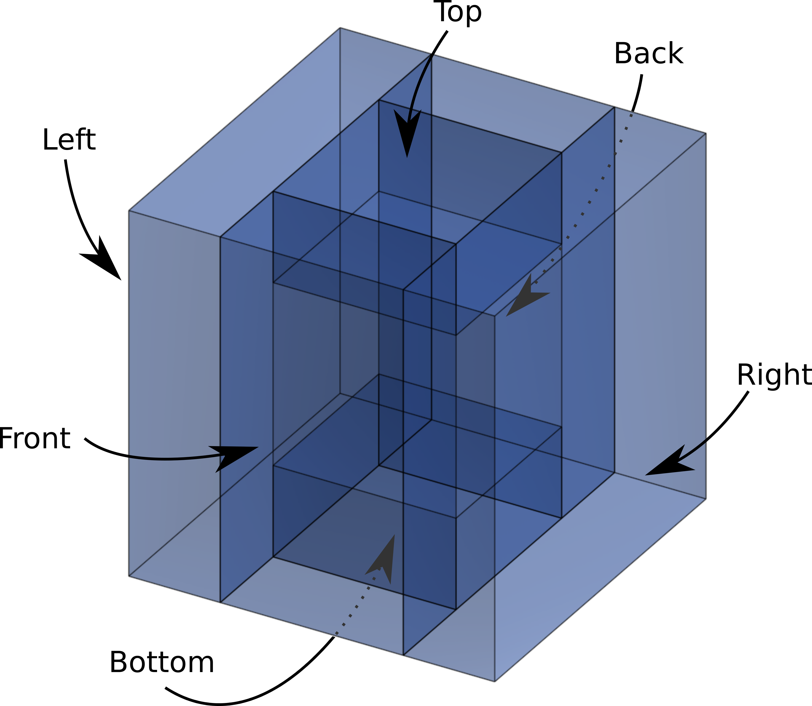

# [Advent of Code 2021](https://adventofcode.com/2021)

This repository holds my solutions for the Advent of Code 2021.
I did every day in Rust, but some are also done in Python (I started in Python and did some speedrun attempts in Python as well).

I did not optimize for speed or for lines of code, but rather tried to write readable, idiomatic Rust. That said, I am still learning Rust and there are probably things I could do better. I also try to limit mutable state, wherever possible. For example, I prefer iterators rather than modifying a mutable variable in a loop. However, in some questions, I was not able to develop a totally immutable solution (in these cases, I like to at least write pure functions, even if there is some mutability inside).

## The problems

A quick summary of the problems and an explanation of my solution. (Spoilers, duh)

**[Day 01: Sonar Sweep](./day_01)**

[Problem statement](https://adventofcode.com/2021/day/1)

The goal of this challenge was simply to find the number of times the value in a sequence increases, or to apply a rolling-sum, then find the number of times the value increases.

 The solution is pretty short using iterators and itertools.

**[Day 02: Dive!](./day_02)**

[Problem statement](https://adventofcode.com/2021/day/2)

The goal of this problem is to execute a series of commands that move the submarine's position, and to determine the final location.

> - `forward X` increases the horizontal position by X units.
> - `down X` increases the depth by X units.
> - `up X` decreases the depth by X units.

Again, the solution is pretty straightforward (it's only day 2).
I use iterators and `fold`.

**[Day 03: Binary Diagnostic](./day_03)**

[Problem statement](https://adventofcode.com/2021/day/3)

This problem was quite interesting. There is a series of binary numbers. In part one, we have to select the most common and least common bit at each position, and interpret the resulting binary number. In part two, we had to filter the numbers by the most common bit value in each position starting from the left until only one number remained. Selecting the most common or least common is quite easy, but I found it surprisingly challenging to select both simultaneously in a concise and DRY way. I think I did alright at this, but not amazing.

I first did this in Python, but I wasn't terribly happing with the implementation and I wanted to do all 25 puzzles in Rust, so I rewrote it.
I made heavy use of iterators and `partition` to split the list of numbers into two based on the bit value in a given position. I could then compare the lengths of the two vectors and keep the largest or smallest.

**[Day 04: Giant Squid](./day_04)**

[Problem statement](https://adventofcode.com/2021/day/4)

This problem was fun! We had to play bingo against a giant squid on many boards and had to calculate the score of the winning board.

I solved this using Rust's [`ndarray`](https://docs.rs/ndarray/latest/ndarray/index.html), which was my first time using it.

**[Day 05: Hydrothermal Venture](./day_05)**

[Problem statement](https://adventofcode.com/2021/day/5)

This problem has many overlapping lines and we have to determine the number of locations where move than two lines cross.

My solution parses the lines into a custom struct, then uses ranges to extract the points from these lines. I use the points to increment a point in the grid using [`ndarray`](https://docs.rs/ndarray/latest/ndarray/index.html).
I am not thrilled with my solution, but it's what I had time for.

**[Day 06: Lanternfish](./day_06)**

[Problem statement](https://adventofcode.com/2021/day/6)

This problem models the exponential growth of lanternfish.

Part one can easily be brute-forced. Since the growth is exponential,
doing the naive implementation of storing the age of each fish is very slow for large inputs (like part 2).
I did not notice the clever trick to store the amount of fish at each age rather than the age of each fish (I think this is how you're "supposed" to do it), so I simplified my reduction and slapped a `#[memoize]` on it, and it's reasonably fast.

**[Day 07: The Treachery of Whales](./day_07)**

[Problem statement](https://adventofcode.com/2021/day/7)

In this problem, you have to align a bunch of crabs to the same horizontal position while expending the least amount of energy.

I first tried the mean/median, but noticed this wasn't right, so I brute-forced it. I later found from reading the subreddit ([/r/adventofcode](https://www.reddit.com/r/adventofcode)) that the median is related to the correct answer, and that a more efficient approach would be to start at the median and work away from it until the correct answer is found. Brute force is still very quick for this small input though.

**[Day 08: Seven Segment Search](./day_08)**

[Problem statement](https://adventofcode.com/2021/day/8)

As an electrical engineer and electronics enthusiast, I loved the appearance of seven-segment displays in this puzzle.
In this problem, the wires for the segments of the display get scrambled.
By observing the display cycle through all 10 digits, we work out which segments are now connected to which wires, and decode the scrambled screen.

I solved this by drawing the display and figuring out the steps I would use to decipher a digit manually.
I represented the segments as sets and used intersections and superset tests to deduce the mapping.

**[Day 09: Smoke Basin](./day_09)**

[Problem statement](https://adventofcode.com/2021/day/9)

This was a clustering problem.
We had to find all the local minima in a 2D grid (part one),
then find all the points in that basin (part two).
Thankfully, there is no overlap between basins;
they are all separated by a wall of the highest possible value (`9`).

Part one is pretty easy. I just loop through all the points in the grid and check if they're lower than their 4 immediate neighbours.
In part two, I implemented a pretty standard breadth-first search
to discover and entire basin,
stopping when I reach a `9`.

**[Day 10: Syntax Scoring](./day_10)**

[Problem statement](https://adventofcode.com/2021/day/10)

Today's puzzle was about detecting and then correcting invalid lines of opening and closing brackets of different types (`[(<{}>)]`).

I solved this by pushing and popping the braces to a stack. If the end of the line is reached and the stack is not empty, then there are unclosed braces. If a closing brace is met that does not correspond to the top of the stack, then it is invalid.

**[Day 11: Dumbo Octopus](./day_11)**

[Problem statement](https://adventofcode.com/2021/day/11)

In this problem, there is a grid of flashing octopuses (I don't know how that works).

The implementation is pretty straightforward. The only tricky part is to maintain a set of flashed octopuses to ensure they don't flash twice.

**[Day 12: Passage Pathing](./day_12)**

[Problem statement](https://adventofcode.com/2021/day/12)

In this problem, we are given a list of edges, and have to count the total number of different paths through it. The catch is that some nodes can be visited multiple times, but others cannot.

The implementation is pretty basic recursive depth-first search.

**[Day 13: Transparent Origami](./day_13)**

[Problem statement](https://adventofcode.com/2021/day/13)

This problem was pretty cool. A secret message is uncovered by repeatedly folding the problem input.

I used [`ndarray`](https://docs.rs/ndarray/latest/ndarray/index.html) and `BitOr` with a bit of housekeeping,
which wasn't too bad.

**[Day 14: Extended Polymerization](./day_14)**

[Problem statement](https://adventofcode.com/2021/day/14)

I really enjoyed solving this problem. Specifically, I enjoyed my naive implementation taking forever for part two and figuring out a clever algorithm to make it faster.
There is a list of characters, and certain pairs of adjacent characters get a third character insert between them.

For part one, it is possible to do string hacking and brute force it, but the size blows up exponentially.
For part two, instead of tracking the exact sequence of characters,
I track the count of pairs of characters.
On each iteration, I replace a pair of characters with two pairs:
the left character with the character that's supposed to be inserted between them, and this inserted character with the right character.

I also attempted to place on the leaderboard for this problem.
I did part one in Python in 12 minutes 46 seconds with a score of 1448,
which is not bad for me.

**[Day 15: Chiton](./day_15)**

[Problem statement](https://adventofcode.com/2021/day/15)

This is a shortest-path problem.
There is a 2D grid of numbers, the cell's number being its weight.

This one actually took me a very long time. I tried desperately to make it immutable and recursive. In the end, it was extremely slow. The reason is that I used a simple list for the queue and I would traverse it each time to find the minimum. I eventually switched to a mutate-in-loop pattern using a priority queue.
This is much faster, as getting the next node is O(1) and enqueueing a node is O(log(N)) (before, it was O(N) and O(1)).
It is not recursive and immutable, but maybe sometimes that is better.
The mutability is at least all contained into the Dijkstra function, and it's more recognizably Dijkstra this way.
Also, it was a neat opportunity to learn [`PriorityQueue`](https://docs.rs/priority-queue/latest/priority_queue/index.html) in Rust.

**[Day 16: Packet Decoder](./day_16)**

[Problem statement](https://adventofcode.com/2021/day/16)

Again, as an electrical engineer, I enjoyed this packet parsing problem.
It is kind of weird that the same protocol specifies the subpackets in number of packets and number of bits,
but I guess that's part of what makes it challenging.

For this one, I developed a recursive decent parser, and got to use [`bitvec`](https://docs.rs/bitvec/0.22.3/bitvec/) for the first time.

This was obviously a very hard problem for everyone, because my times of 51:34 and 58:56 scored 1341 and 1016.
These are my two best scores.

**[Day 17: Trick Shot](./day_17)**

[Problem statement](https://adventofcode.com/2021/day/17)

Day 17 is a (not very accurate) physics simulation. You have to calculate the path traced by a projectile and determine the starting velocity that results in the highest apex.

Part one, I was able to calculate analytically. The horizontal and vertical axes are independent,
so I determined expression that let me quickly calculate both to reach the maximum height.
Part two was tricky. You have to list all the possible starting velocities that reach the target (including negative vertical velocities, which cannot be calculated in the same way as before).
I brute-forced part two. It is still very quick.
I have seen some discussion on [/r/adventofcode](https://www.reddit.com/r/adventofcode) of people calculating in analytically, and I would have liked to do that, but I have not had the time.

**[Day 18: Snailfish](./day_18)**

[Problem statement](https://adventofcode.com/2021/day/18)

This one was quite tricky, but also pretty fun.
It introduces a strange binary-tree-esque numbering system.
If the tree becomes too tall, the leftmost leaf explodes.
If a leaf has a value greater than ten, it splits.

I implemented a binary tree and made a recursive function to handle all the explosions and splits.
I did something new (to me) and uses exceptions for things other than `Error`
to short-circuit (with `?`) when an explosion or split is detected and to pass that value up the tree.
Another tricky thing is that explosions need to go up the tree on each side of the explosion, but go down the tree on the other side.
For example, the left value goes up until it is coming from a right child, then that value has to be added to rightmost grandchild of the left child.

**[Day 19: Beacon Scanner](./day_19)**

[Problem statement](https://adventofcode.com/2021/day/19)

This is a point-cloud-joining problem.
There are many scanners in 3D space at unknown positions and rotations with overlapping detection ranges.
The problem is to discover where all of the scanners are and to get all of the detected points into the same reference frame.

I first solve this in Python in the most naive way possible (7 nested loops) to get my head around it.
Actually, I started with a simplified 2D version to make visualizations easier, then did the example from the problem statement.
This naive version is the epitome of brute-force.
Firs, the zeroth scanner is selected as the reference.
Then, while there are still disconnected scanners,
it loops through all the other scanners,
loops through all the zeroth scanner's points,
loops through all the current scanner's points,
and loops through all the possible rotations of the current scanner (4x4x4).
All of the points of the current scanner are rotated and translated by the difference between these two points.
If the intersection between the zeroth scanner's points and these transformed points contains more than 12 elements (from the problem statement),
then position of this scanner is known.
This first part about "while there are disconnected scanners, loop through all scanners" is required in case the first selected scanner does not intersect with the zeroth scanner.

This was surprisingly not slow as molasses. Granted, it took more than a few seconds, but I expected worse.
Still, I wanted to optimize this.
I wanted a way to find the connections between the scanners without all this looping.
I was thinking hashing, but I'm not sure how this would work.
I then found that the distances between every pair of points in a scanner can act as a kind of key
that is independent of rotation and translation.
I could calculate the sets of all such distances,
and compare the intersections of these sets between scanners to build a graph.
Indeed, if two scanners share 66 distances, then we can safely assume that they are connected
(it is still possible that they are not and that this is just a coincidence).
I use breadth-first search to build a connection tree
that represents the order in which to visit the scanners,
where each scanner appears only once.
This also allows me to verify that the graph is connected.

The final step is to traverse this tree and transform all the points (and the scanner origins themselves) to the same reference.
This works bottom-up, transforming each scanner to its parent's perspective and merging all siblings until the root.

This is much faster, as we can directly know the connected scanners and even the matching points to use for translation.
I still brute-force the rotations, but it now takes a small fraction of the time.

**[Day 20: Trench Map](./day_20)**

[Problem statement](https://adventofcode.com/2021/day/20)

This problem defines a binary image and an algorithm (bit sequence).
You must repeatedly convolve a 3x3 window over the image,
interpret the 9 bits from the window as an index to look up a value in the algorithm,
and replace the window with that value.
This has the effect of shrinking the image by two (you also have to pad by 4 beforehand for edge effects).
One wrench thrown in the mix is that the image is "infinite",
and while the example in the problem statement has a zero in the zeroth position of the algorithm,
the real input has a one.
When the zeroth bit in the algorithm is a one,
the infinite grid is flipped on every iteration
(every 3x3 cell of all zeroes becomes a one).
There are always an even number of iterations,
so you will always have finitely-many bright pixels at the end.
You just have to be careful about the value with which you are padding.

This was surprisingly easy in Rust with [`ndarray`](https://docs.rs/ndarray/latest/ndarray/index.html),
even though I had to copy-paste [a pad function from GitHub](https://github.com/rust-ndarray/ndarray/issues/823).
Iterating through 3x3 windows is built into `ndarray`, and then it's just a matter of converting 9 bits to an integer and indexing the algorithm.

**[Day 21: Dirac Dice](./day_21)**

[Problem statement](https://adventofcode.com/2021/day/21)

This problem is about a dice game with two players moving around in a circle by the sum of three dice rolls.
Each turn, a player's score is incremented by their current position.
In part one, the die is deterministic and yields every positive integer in order.
In part two, the die is quantum and yields `1`, `2`, and `3` simultaneously.

Part one was straightforward, but part two was more complicated.
My implementation is still kind of brute-force,
but by accounting for duplicate moves, it is doable.
The sum of 3 3-sided dice has duplicates
(for example, there is only 1 way to roll 3, but 3 ways to roll 4 and 7 ways to roll 6),
which limits the possibilities to 9.
This is required for the algorithm to terminate in a reasonable amount of time.
The alternative would be to consider all possible values of the three dice,
which is 27 cases.

**[Day 22: Reactor Reboot](./day_22)**

[Problem statement](https://adventofcode.com/2021/day/22)

This problem has many overlapping cuboids
which represent operations on the contained voxels.
Some cuboids represent "on" operations, while the rest represent "off" operations.
All the voxels default to "off", can be turned "on" if they find themselves inside any "on" operation,
and are turned "off" if they are inside any "off" cuboid.
The operations are processed in order,
so a voxels value is determined by the latest operation it finds itself inside.

In part one, it is possible to brute-force.
The space is small enough that you can just maintain a hashmap of each voxel,
loop through the operations, and turn "on" or "off" all the voxels inside each new cuboid.

In part two, the search space is far too big to flip voxels individually.
I have seen people solve this using a tree,
but opted to represent the cuboids as ranges
and perform boolean operations on them.
At the end, the total volume of all the cuboids is equivalent to the total number of "on" voxels.
The trick is to maintain a set of cuboids that never overlap.
I only store "on" cuboids,
and if the cuboid currently being processed is "on",
I subtract it from all the existing cuboids, then add it to the collection.
If the incoming cuboid is "off",
I simply subtract it from all the existing cuboids (no need to keep it).
This way, I will have a set of non-intersecting "on" cuboids.
I have to ensure that no cuboids intersect because a voxel can only be "on" or "off".
Setting a voxel "on" twice does not count for two.
By "subtract a cuboid from a cuboid", I mean replace the cuboid
with a set of cuboids representing the boolean difference between the two cuboids.
In other words, a set of cuboids whose union contains a voxel if and only if that voxel was inside the first cuboid (the cuboid being subtracted from) and not inside the second cuboid (the cuboid doing the subtracting; the cuboid currently being processed).

I implemented a `struct Cuboid` with a `Sub` trait for this.
Let's call the cuboid being subtracted from cuboid A and the cuboid being processed cuboid B.
I first start with the X axis, and replace cuboid A with 3:
a cuboid with the same size in Y and Z as A but that goes from A's left face (the face parallel to YZ with the smallest value of X) to B's left face, a cuboid from B's left face to B's right face, and a cuboid from B's right face to A's right face.
Then, I do Y.
I replace this middle cuboid (B's left face to B's right face)
with a new 3 following the same procedure,
but this time the new cuboids are only span B's range in X, not A's.
Then finally, I do the same for Z using the middle cuboid from Y
and discard the middle cuboid from Z.
The result is 6 cuboids that do not overlap that represent the boolean operation A - B.
It is possible (even likely) that A does not totally surround B.
Therefore, I filter out cuboids with negative volumes.

For example, in the left image below,
subtracting B from A will result in the 6 non-intersecting cuboids
"left", "right", "front", "back", "top", and "bottom".
<p float="left" align="middle">
	
	
</p>

This problem took me a very long time.
First of all, the cuboids do not follow intuition.
Their dimensions represent ranges of integer values (the voxels they encompass).
If a cuboid starts at 0 and ends at 10, you may expect it to be 10 units long
(like on a real world ruler; the "10" mark is 10 units from the "0" mark),
but it actually contains 11 units including the zeroth and the tenth.
This means I had to do a lot of `+1` and `-1` in the boolean difference code,
which is prime real estate for off-by-one errors.
Furthermore, for the longest time, I had a bug because I did not realize that two cuboids could intersect
while none of their corners are inside the other.
This is obvious in hindsight, but took me a very long time to debug.
In the end, I added a function to check if two rectangles are intersecting
(which is much easier)
and used the fact that two cuboids are intersecting if and only if all three of their projections in X, Y, and Z are intersecting.

**[Day 23: Amphipod](./day_23)**

[Problem statement](https://adventofcode.com/2021/day/23)

This is an optimization problem with the goal of moving amphipods of four different types to their assigned rooms.

The example from the problem statement is the following, where `.` is an empty space, `#` is a wall, and `A`-`D` are the four types of amphipod:
```
#############           #############
#...........#           #...........#
###B#C#B#D###  becomes  ###A#B#C#D###
  #A#D#C#A#               #A#B#C#D#
  #########               #########
```
The format is always the same as this example, only the initial positions of the amphipods changes.

**TLDR:** I used Dijkstra.

Full story:

I think this problem took me the longest. Either this or day 24.
I solved part 1 in my text editor by cutting amphipods, counting keystrokes, and pasting them somewhere else.
However, I did not trust myself to find the minimum cost doing this for part two.

I first implemented this using a modification of Dijkstra that moved between adjacent states.
This implementation was pretty naive: it considers every move of an amphipod to an adjacent empty space for the next move.
It should in theory find the correct solution eventually, though.
By selecting the future state with the least cost continuously until a solution is found,
it is guaranteed that if any solution is found, it will be the cheapest.
This implementation took 6 minutes for part one,
but when I let it run part two overnight,
it ate all my RAM and crashed.

I then reread the problem statement and found that I skipped over some important details:

> - Amphipods will never stop on the space immediately outside any room. …
> - Amphipods will never move from the hallway into a room unless that room is their destination room. …
> - Once an amphipod stops moving in the hallway, it will stay in that spot until it can move into a room. …

Why my solution technically finds the right answer, it is considering way too many moves (actually, there are even more "invalid" or "stupid" moves than these).
Hacking the first condition into my existing code was pretty easy;
If I detect that an amphipod is directly outside a room, I reject any next state that does not correct this.
The next constraint was also doable.
However, the final criterion was very challenging to implement (into my terrible code).
I added some state to track if an amphipod started moving in the hallway and would reject any moves that do not take this one home.
This code was horrible to look at and very buggy. What's more, it still took forever! It was clear I was going about this the wrong way.

Therefore, I totally changed my strategy.
First, I check if any amphipod can move to its room. If it has a clear path to its room, and its room contains no amphipods of another type, I force the next move to take this amphipod home.
Second, if there are no amphipods that can go to their room, I enqueue all the possible moves that take an amphipod into the hallway.
Unlike before, I do this intelligently: I only consider valid waiting spots in the hallway (not directly outside a room), and I don't consider moving amphipods that are already in the right room and that aren't blocking another type.

One good thing about the first implementation is that I didn't have to do any fancy calculations to determine if a spot was reachable from another spot. I only consider adjacent moves to empty spaces. Furthermore, I don't have to calculate the cost of a given jump. I only move one spot at a time, so I increment the cost by 1 (times the cost of the current amphipod type).
For this new algorithm, I could not rely on this. I made a function to return `Some(cost)` of a jump if reachable, and `None` if it's unreachable (in which case, I know not to enqueue the move).
I could have used some kind of search for this, but since everything is straight lines and there is only one path (that does not visit the same node twice) from a location to another, I calculate three (into the hallway, over, and down) ranges of points, loop through them, and check that they are all empty.

This did the trick. By limit the allowable moves like this,
I can solve both parts in a fraction of a second.
It is also much easier to reason about than the terrible code to detect these disallowed states and reject future moves.

**[Day 24: Arithmetic Logic Unit](./day_24)**

[Problem statement](https://adventofcode.com/2021/day/24)

This problem was something else.
It was probably the one that was the least obvious of how to solve after the first read.
The problem defines a language reminiscent of assembly, but with only six basic instructions (talk about RISK!).
The problem statement only defines the language and that we are looking for the largest number that satisfies the program given as input (satisfies meaning that register z=0 when the program terminates).

The first thing I did was examine the input and work out what it was doing using pen and paper.
I won't get into that because there are [better write-ups out there](https://github.com/dphilipson/advent-of-code-2021/blob/master/src/days/day24.rs).
Once I played around with it on paper (and snooped around the internet a bit),
I eventually figured out how to solve this.
The program works like a stack machine, but when calculating the largest valid input,
you don't know ahead of time what to push onto the stack.
The pushed number depends on the current digit, and the valid range for this digit depends on some instructions from the digit that pops this value. That means guessing that the current digit is larger than its valid range results in some subsequent digit having to be >9 in order for the z register to be zero at the end.
Therefore, I made a recursive function that matches pushes to their corresponding pops.
By processing both simultaneously, we have all the information we need to directly calculate the maximum (or minimum, for part two) value of the first value (most significant) while respecting the valid range of the second value.
The function performs this matching of pushes and pops
by reading one push instruction from the input (the first instruction is always a push, and the function ensures that all pushes and pops are removed together),
then calling itself recursively.
This has the effect of processing any pairs of instructions that come between this push instruction that we just read and its matching pop.
If the next operation is a pop, it returns immediately.
At this point, the corresponding pop instruction is taken off the input,
and the digit for each is calculated.
Finally, the function calls itself again to handle any remaining instructions,
and all of these are chained together (the digit of the push instruction, all the digits in between corresponding to the first recursive call, the digit of the pop instruction, and all the digits from the second recursive call).
For a problem that is so slow to brute force (9<sup>14</sup> possibilities!),
this solution is incredibly quick at <0.01s.

**[Day 25: Sea Cucumber](./day_25)**

[Problem statement](https://adventofcode.com/2021/day/25)

Ending on an easy one!
This is the Biham-Middleton-Levine Traffic Model problem.
There are sea cucumbers in a 2D grid with PacMan physics (leaving from the right means reappearing on the left).
Some cucumbers can only move down while others can only move right.
The challenge is to determine the first step where no sea cucumbers move (where they are all blocked).

This was pretty easy to solve.
I don't know any way to do it other than just to simulate it.
I used a recursive function to handle the repeated steps,
and stored the position of the cukes in a hashmap (I got sick of `ndarray`).
